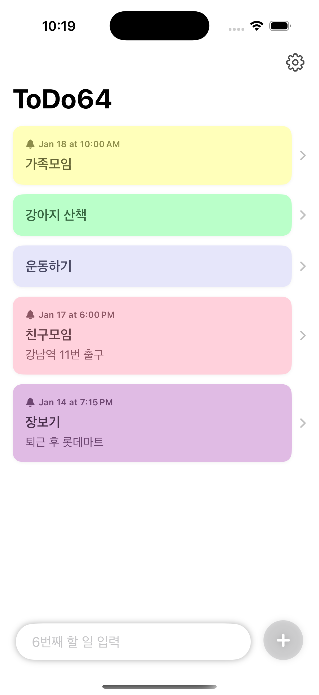

# ToDo64 📝

**ToDo64** is a clean, modern iOS To-Do application built with **SwiftUI** and **SwiftData**. It focuses on simplicity and reliability, offering a streamlined experience for managing your daily tasks with integrated local notifications.

The name "64" signifies the deliberate design choice to limit the list to **64 items**, ensuring focus and aligning with iOS Local Notification system limits.

## ✨ Key Features

-   **Simple & Fast:** Minimalist design for quick task entry and management.
-   **Local Reminders:** Set notifications for your tasks so you never miss a deadline.
-   **64-Item Limit:** A constraint to keep you focused on what truly matters (and to ensure notification reliability).
-   **Pastel Aesthetics:** Each task automatically gets a random, soothing pastel background color for visual variety.
-   **Data Safety:**
    -   **Backup & Restore:** Easily export your data to JSON or restore from a backup file.
    -   **Corruption Handling:** Automatic detection and isolation of corrupted data to prevent app crashes.
-   **Modern Gestures:**
    -   Swipe **Right** to toggle completion status.
    -   Swipe **Left** to delete an item.
-   **Dark Mode Support:** Optimized for both light and dark system appearances.

## 🛠 Tech Stack

-   **Language:** Swift
-   **UI Framework:** SwiftUI
-   **Persistence:** SwiftData
-   **Architecture:** MVVM (Model-View-ViewModel)
-   **Minimum Target:** iOS 18.5+

## 📱 Screenshot

<div align="center">
  
</div>

## 🚀 Installation

1.  Clone the repository.
    ```bash
    git clone https://github.com/username/ToDo64.git
    ```
2.  Open `Sources/ToDo64/ToDo64.xcodeproj` in Xcode.
3.  Build and run on your simulator or device (Requires iOS 18.5+).

## 💡 How to Use

1.  **Add Item:** Type a title in the bottom input bar and tap the `+` button.
2.  **Complete Item:** Swipe right on an item or tap the circle/check icon.
3.  **Delete Item:** Swipe left on an item or use the trash icon in the detail view.
4.  **Edit/Details:** Tap on any item to view details, add a memo, or set a reminder time.
5.  **Settings:** Tap the gear icon to manage backups, contact support, or view app info.

## ⚠️ Limitations

-   **Max Items:** You can only store up to 64 active tasks. This is tied to the `UNUserNotificationCenter` scheduling limits and encourages completing tasks before adding more.

## 🤝 Contributing

Contributions are welcome! If you have ideas for improvements, feel free to open an issue or submit a pull request.

## 📄 License

This project is licensed under the MIT License - see the [LICENSE](LICENSE) file for details.